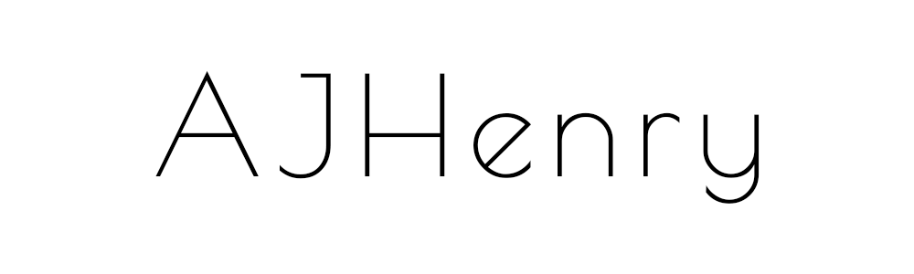

  

<h2 align="center">I'm Andrew, a full-stack software engineer and Open Source advocate</h2>

  <a href="https://github.com/AJHenry/AJHenry/blob/master/README.md">Source</a> •
  <a href="https://simpleicons.org/">Icons</a> •
  <a href="https://github.com/AJHenry/AJHenry/blob/master/LICENSE">License</a>

 
<h3 align="center">Tech I Enjoy the Most</h3>

 
<h3 align="center">Tech I have Experience with</h3>

 
<h3 align="center">Connect with Me</h3>

